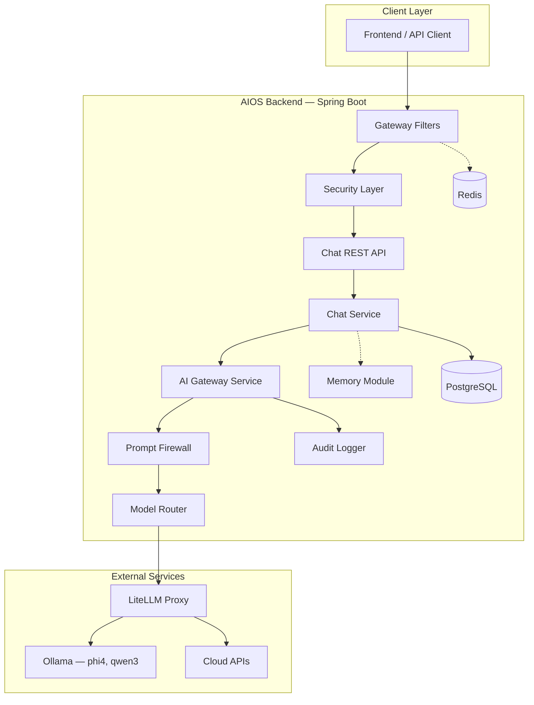
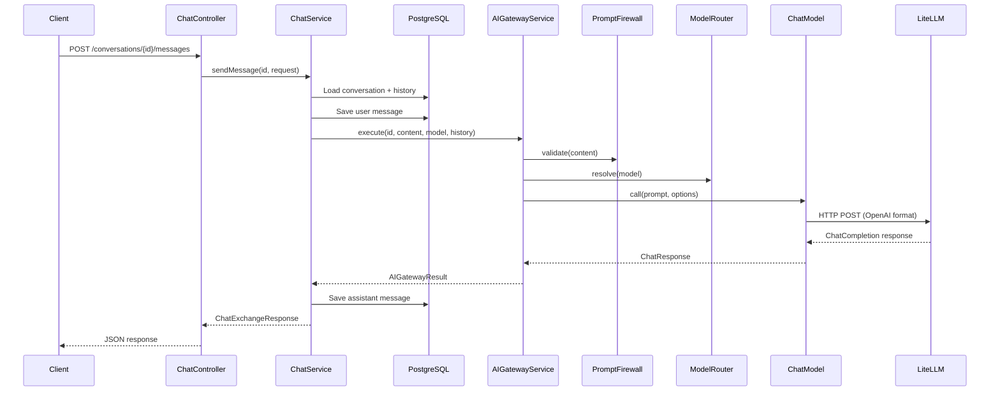

# AIOS Architecture

## System Overview

AIOS is a layered backend that treats LLM access as a **privileged operation** requiring gateway mediation. External models are never called directly from HTTP handlers.



## Security Model

### Zero Trust Principles

- Every `/api/v1/chat/**` request requires authentication (currently API key, JWT planned).
- No server-side sessions — `SessionCreationPolicy.STATELESS`.
- Strict HTTP security headers (CSP, HSTS, frame denial, referrer policy).
- Error responses never expose stack traces or internal messages.
- Prompt content is never written to application logs.

### Authentication Flow (current)

```
Request → ApiKeyAuthenticationFilter
              │
              ├─ Valid X-API-Key header → ROLE_API_USER granted
              └─ Missing/invalid key → 401 Unauthorized
```

### Prompt Firewall

`PromptFirewall` scans user input before any LLM call:

- Blocks jailbreak patterns (DAN mode, instruction overrides, system prompt extraction)
- Enforces maximum prompt length (32,000 characters)
- Rejects empty prompts
- Throws `PromptFirewallException` → HTTP 400 with `PROMPT_FIREWALL_REJECTED`

## AI Gateway Execution Pipeline

`AIGatewayService.execute()` is the single entry point for all LLM invocations:

```
1. Prompt Firewall Check
   └─ validate(prompt) — reject malicious input

2. Model Routing
   └─ ModelRouter.resolve(requestedModel) → phi4 | qwen3

3. Execution with Retry
   └─ Build message history from DB
   └─ Call ChatModel via Spring AI (OpenAI-compatible → LiteLLM)
   └─ Retry up to aios.ai.max-retries on transient failure

4. Fallback
   └─ If primary model fails → ModelRouter.fallbackModel()

5. Audit Logging (async)
   └─ Log: conversationId, model, latencyMs, tokens, fallbackUsed
   └─ Never log: prompt text, response content, API keys
```

## Data Flow — Send Message



## Module Design

### gateway/

Edge-layer concerns applied before Spring Security:

- `GatewayRequestFilter` — adds gateway headers, future request shaping
- `RateLimitingService` — placeholder for Redis token-bucket limiting

### ai/

The AI abstraction layer. This is the most critical module.

- `AIGatewayService` — orchestration entry point
- `PromptFirewall` — input sanitization and policy enforcement
- `ModelRouter` — model alias resolution and fallback selection
- `AuditLogger` — async metadata-only logging
- `LiteLLMClient` — placeholder for direct LiteLLM admin operations

### chat/

Domain module for conversations and messages.

- **Entities**: `Conversation`, `Message`, `MessageRole`
- **Repositories**: JPA interfaces with transactional queries
- **Service**: `ChatService` — owns `@Transactional` boundaries
- **Controller**: `ChatController` — validation and HTTP mapping only

### memory/

Placeholder for future context orchestration:

- Long-term memory retrieval
- RAG pipeline integration
- Context window management

### auth/

Spring Security configuration:

- `SecurityConfig` — filter chain, CORS, headers, endpoint authorization
- `ApiKeyAuthenticationFilter` — placeholder auth (replace with JWT)

### common/

Cross-cutting shared code:

- `ApiResponse<T>` / `ApiErrorResponse` — uniform JSON envelopes
- `GlobalExceptionHandler` — maps exceptions to HTTP status codes
- `SecurityUtils` — principal extraction helper
- `RequestLoggingInterceptor` — debug-level request metadata logging

### config/

Spring configuration beans:

- `AiosProperties` — `@ConfigurationProperties` for `aios.*` prefix
- `JpaConfig`, `RedisConfig`, `WebConfig`, `AsyncConfig`

## Database Design

### conversations

| Column | Type | Notes |
|--------|------|-------|
| id | UUID | PK, auto-generated |
| title | VARCHAR(255) | Auto-set from first message |
| created_at | TIMESTAMP | UTC |
| updated_at | TIMESTAMP | UTC, updated on each message |
| model_used | VARCHAR(100) | Last model that served this conversation |

### messages

| Column | Type | Notes |
|--------|------|-------|
| id | UUID | PK |
| conversation_id | UUID | FK → conversations, CASCADE delete |
| role | VARCHAR(20) | CHECK: user, assistant, system |
| content | TEXT | Encrypted payload placeholder |
| tokens_used | INT | From LLM response metadata |
| latency_ms | BIGINT | Gateway-measured round-trip |
| created_at | TIMESTAMP | UTC |

Schema is managed exclusively by Flyway (`V1__init_schema.sql`). Hibernate `ddl-auto` is `validate`.

## Infrastructure

### Docker Compose Services

| Service | Image | Port | Purpose |
|---------|-------|------|---------|
| postgres | postgres:16-alpine | 5432 | Primary data store |
| redis | redis:7-alpine | 6379 | Caching, future rate limiting |

### External Dependencies (not in Compose yet)

| Service | Default URL | Purpose |
|---------|-------------|---------|
| LiteLLM | http://localhost:4000 | LLM proxy / router |
| Ollama | http://localhost:11434 | Local model runtime |

## Error Handling Strategy

| Exception | HTTP Status | Error Code |
|-----------|-------------|------------|
| `ResourceNotFoundException` | 404 | `RESOURCE_NOT_FOUND` |
| `PromptFirewallException` | 400 | `PROMPT_FIREWALL_REJECTED` |
| `MethodArgumentNotValidException` | 400 | `VALIDATION_ERROR` |
| `IllegalStateException` (AI failure) | 503 | `AI_GATEWAY_ERROR` |
| Unhandled | 500 | `INTERNAL_ERROR` |

All errors return `ApiErrorResponse` with `success: false` and no stack traces.

## Future Architecture Additions

1. **JWT Resource Server** — replace API key filter in `auth/`
2. **Redis Rate Limiting** — wire `RateLimitingService` to `gateway/`
3. **Message Encryption** — envelope encryption for `messages.content`
4. **Memory/RAG** — implement `MemoryOrchestrationService` with vector store
5. **Event Bus** — async domain events for audit trail and analytics
6. **LiteLLM in Compose** — containerize the full local AI stack
